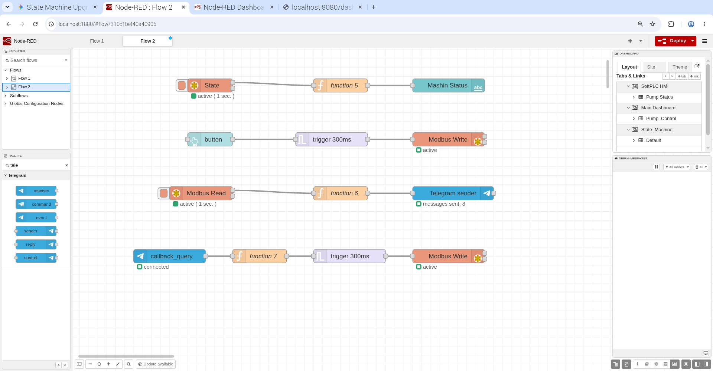
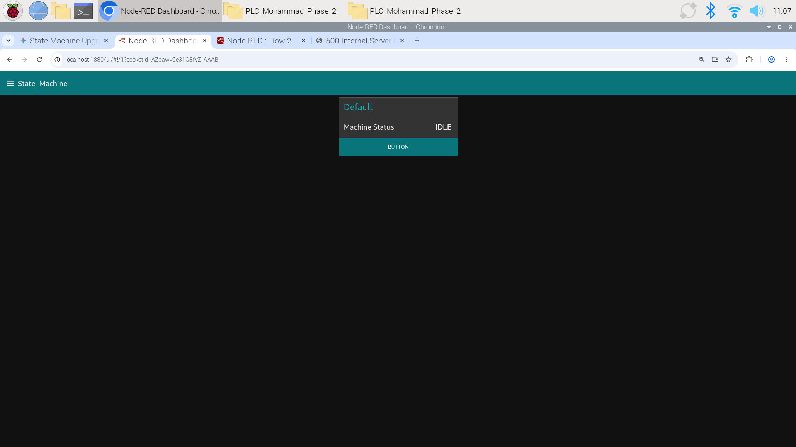
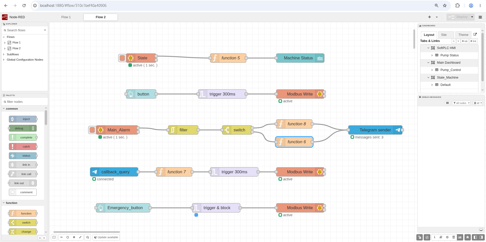
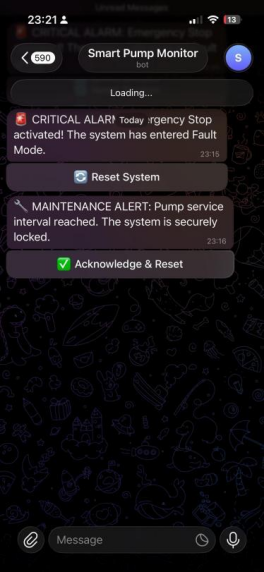
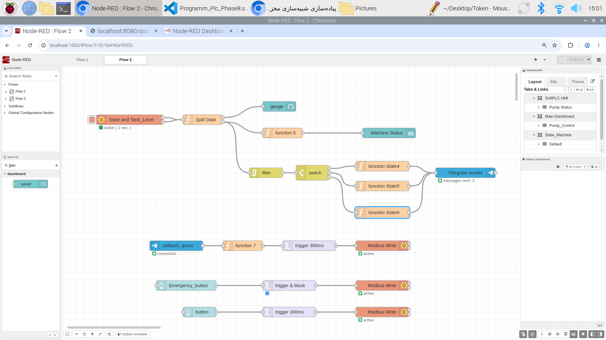
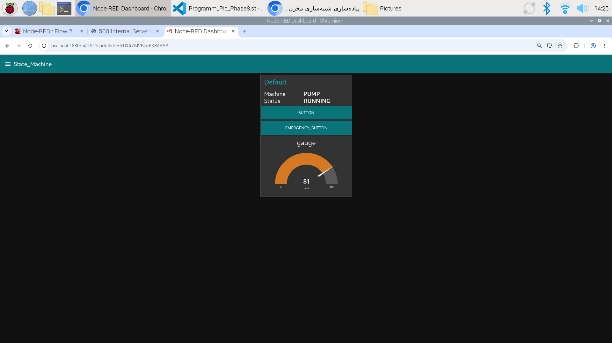
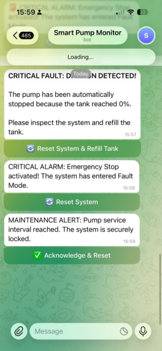
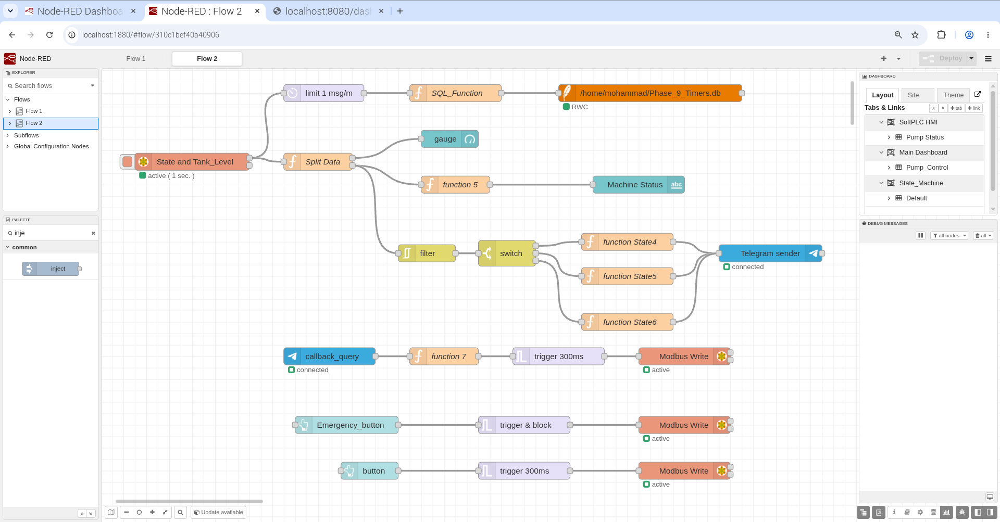
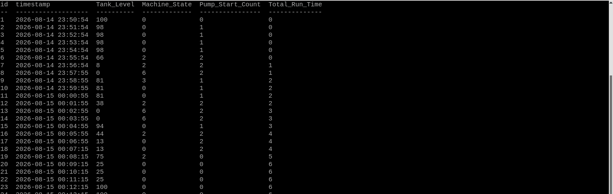

# 🏭 Phase 6: Advanced State Machine Architecture & Telegram IoT Integration

Building upon the previous Latch-based logic, this phase introduces a complete architectural overhaul of the SoftPLC. The control logic has been upgraded to a **State Machine (CASE OF)** to ensure strict sequence control, eliminate race conditions (like relay chatter), and provide a robust foundation for IoT integration.

## 🏗️ Architectural Upgrades

### 1. State Machine Implementation (Structured Text)
Instead of relying on complex boolean latching, the system now operates in strictly defined states. This guarantees that timers, like the 3-Second Start Delay and 5-Second Stop Delay, execute flawlessly without interference.

**System States:**
*   `State 0`: **Idle / Ready** - Pump is OFF, waiting for commands.
*   `State 1`: **Start Delay** - Evaluating input stability (3s Debounce/Delay).
*   `State 2`: **Running** - Pump is ON.
*   `State 3`: **Stop Delay** - Line clearing active (5s Delay).
*   `State 4`: **Fault** - Hardware fault state.
*   `State 5`: **Maintenance Lock** - Reached cycle limit, pump interlocked.

### 2. Resolving Industrial Control Bugs (Engineering Notes)
During the development of this State Machine, two critical industrial bugs were identified and resolved:
*   **Timer Placement Issue:** Moving `TON` and `TOF` blocks *outside* the `CASE` statement ensures timers process accurately across state transitions, preventing instant-triggering and relay chattering.
*   **Fail-Safe Reset Logic:** Designed the `Mode_Reset` tag to self-clear (`Mode_Reset := FALSE;`) immediately within the PLC code after execution. This prevents the Counter's Reset pin (`R`) from being permanently pulled high by network delays.

## 🌐 Node-RED & Telegram API Integration (IoT)

The HMI has been extended beyond a local web dashboard to include real-time mobile alerts and remote control via the Telegram API.

*   **Smart Alarming:** When the system enters `State 5` (Maintenance), a Node-RED `Modbus Read` node captures the state and triggers a JavaScript function to format a JSON payload.
*   **Remote Interlock Reset:** The Telegram alert includes an **Inline Keyboard Button**. Clicking this button sends a `callback_query` to Node-RED.
*   **Pulse Generation:** Node-RED receives the callback and generates a precise **300ms trigger pulse** (via `Modbus Write`), mimicking a physical momentary push-button to safely reset the PLC state.

## 💻 Final Structured Text (ST) Code

Below is the optimized, bug-free State Machine logic used in the OpenPLC runtime:

```iecst
PROGRAM main
    VAR
        Start_Btn AT %IX0.0 : BOOL;
        Stop_Btn AT %IX0.1 : BOOL;
        Relay_Pump AT %QX0.0 : BOOL;
        System_Mode AT %QX0.2: BOOL;
        Sim_Tank_Level AT %QW0 : INT;
        State AT %QW1 : INT;
        Main_Alarm AT %QX0.3 : BOOL;
        Mode_Reset AT %QX0.4 : BOOL;
    END_VAR
    
    VAR
        Fault : BOOL;
        Delay_Timer : TON;
        Delay_Timer_2 : TON;
        Pump_Counter : CTU;
    END_VAR
    
    // Core timing and counting logic placed outside the CASE statement
    // to prevent execution freezing during state transitions.
    Delay_Timer(IN := (State = 1), PT := T#3s);
    Delay_Timer_2(IN := (State = 3), PT := T#5s);
    Pump_Counter(CU := (State = 2), R := Mode_Reset, PV := 3);
    
    CASE State OF
        0:
            Relay_Pump := FALSE;
            IF Start_Btn = FALSE THEN
                State := 1;
            END_IF;
            IF Pump_Counter.Q = TRUE THEN
                State := 5;
            END_IF;    
            
        1:
            Relay_Pump := FALSE;
            IF Delay_Timer.Q = TRUE THEN
                State := 2;
            END_IF;
            
        2:
            Relay_Pump := TRUE;
            IF Stop_Btn = FALSE THEN
                State := 3;
            END_IF;
            
        3:
            Relay_Pump := FALSE;
            IF Delay_Timer_2.Q = TRUE THEN
                State := 0;
            END_IF;
            IF Pump_Counter.Q = TRUE THEN
                State := 5;
            END_IF; 
            
        4:
            IF Fault = TRUE THEN
                State := 0;
            END_IF;
            
        5:
            Relay_Pump := FALSE;
            Main_Alarm := TRUE;
            IF Mode_Reset = TRUE THEN
                Main_Alarm := FALSE;
                Mode_Reset := FALSE; // Fail-safe software reset
                State := 0;
            END_IF;
    END_CASE;
    
END_PROGRAM

CONFIGURATION Config0
    RESOURCE Res0 ON PLC
        TASK Task0 (INTERVAL := T#20ms, PRIORITY := 0);
        PROGRAM Inst0 WITH Task0 : main;
    END_RESOURCE
END_CONFIGURATION
```

## 📸 Snapshots

**1. Node-RED Flow (IoT & State Machine Integration):**


**2. HMI Dashboard (System Status):**


# 🚀 Phase 7: Smart Fault Management & Intelligent IoT Alarming

Building upon the robust State Machine architecture introduced in Phase 6[cite: 1], Phase 7 focuses on implementing a strict industrial Safe State (Fault Management) and upgrading the IoT alarming system to be fully context-aware using Modbus Holding Registers.

## 🏗️ Architectural Upgrades

### 1. E-Stop & Fault Management (State 4)
In the previous phase, State 4 was a placeholder[cite: 1]. It has now been fully developed into a rigid **Safe State**.
*   **Highest Priority Interlock:** The Emergency Stop (`E_Stop`) logic is placed outside and before the `CASE` statement. If triggered, it overrides all other conditions and immediately forces the system into `State 4`.
*   **Safe Reset Logic:** To exit State 4, the physical E-Stop must be released first. Only then will a reset command be accepted.

### 2. Fail-Safe Reset Mechanism (Anti-Stuck)
A critical industrial safety enhancement was added to prevent "Stuck Reset" conditions caused by network latency.
*   If a reset pulse from the IoT layer (Telegram/Node-RED) remains active (`Mode_Reset = TRUE`), the PLC now actively forces it to `FALSE` after processing. This ensures the Modbus connection cannot permanently lock the maintenance counter's reset pin.

## 🌐 Advanced IoT Integration (Node-RED)

The alarming system was upgraded from reading a simple boolean coil to reading integer-based states, allowing the Telegram bot to understand exactly *why* the system stopped.

*   **Modbus Register Reading:** Node-RED now reads the `State` tag directly from a Modbus Holding Register (FC 3) instead of a simple boolean alarm coil.
*   **RBE Filtering & Switch Logic:** An `rbe` (Filter) node prevents alarm spamming by blocking duplicate values. A `switch` node then routes the payload based on the specific fault state (4 or 5).
*   **Context-Aware Telegram Alerts:** 
    *   If `State 4`: Sends a Critical E-Stop alert.
    *   If `State 5`: Sends a Maintenance/Service alert.
*   **Inline Keyboards (Glass Buttons):** Both alerts include specific English inline keyboard buttons allowing operators to remotely acknowledge and reset the exact fault directly from Telegram.

## 💻 Final Structured Text (ST) Code

Below is the updated State Machine logic used in the OpenPLC runtime for Phase 7:

```iecst
PROGRAM main
    VAR
        Start_Btn AT %IX0.0 : BOOL;
        Stop_Btn AT %IX0.1 : BOOL;
        Relay_Pump AT %QX0.0 : BOOL;
        System_Mode AT %QX0.2 : BOOL;
        Sim_Tank_Level AT %QW0 : INT;
        State AT %QW1 : INT;
        Main_Alarm AT %QX0.3 : BOOL;
        Mode_Reset AT %QX0.4 : BOOL;
        E_Stop AT %QX0.5 : BOOL;
    END_VAR
    
    VAR
        Delay_Timer : TON;
        Delay_Timer_2 : TON;
        Pump_Counter : CTU;
    END_VAR

    // Isolated Timers and Counters
    Delay_Timer(IN := (State = 1), PT := T#3s);
    Delay_Timer_2(IN := (State = 3), PT := T#5s);
    Pump_Counter(CU := (State = 2), R := Mode_Reset, PV := 3);

    // Network Pulse Protection (Fail-Safe Reset)
    IF Mode_Reset = TRUE AND State < 4 THEN
        Mode_Reset := FALSE;
    END_IF;

    // E-Stop Logic (Highest Priority Override)
    IF E_Stop = TRUE THEN
        State := 4;
    END_IF;

    CASE State OF
        0: // Idle
            Relay_Pump := FALSE;
            Main_Alarm := FALSE;
            
            IF Pump_Counter.Q = TRUE THEN
                State := 5;
            ELSIF Start_Btn = FALSE THEN 
                State := 1;
            END_IF;
            
        1: // Start Delay
            IF Delay_Timer.Q = TRUE THEN
                State := 2;
            END_IF;
            
        2: // Running
            Relay_Pump := TRUE;
            IF Stop_Btn = FALSE THEN
                State := 3;
            END_IF;
            
        3: // Stop Delay
            IF Delay_Timer_2.Q = TRUE THEN
                State := 0;
            END_IF;
            
            IF Pump_Counter.Q = TRUE THEN
                State := 5;
            END_IF; 
            
        4: // Fault Mode (E-Stop)
            Relay_Pump := FALSE;
            Main_Alarm := TRUE;
            
            IF Mode_Reset = TRUE AND E_Stop = FALSE THEN
                Mode_Reset := FALSE;
                Main_Alarm := FALSE;
                State := 0;
            END_IF;
            
        5: // Maintenance Lock
            Relay_Pump := FALSE;
            Main_Alarm := TRUE;
            
            IF Mode_Reset = TRUE THEN
                Main_Alarm := FALSE;
                Mode_Reset := FALSE;
                E_Stop := FALSE;
                State := 0;
            END_IF;    
    END_CASE;

END_PROGRAM

CONFIGURATION Config0
    RESOURCE Res0 ON PLC
        TASK Task0 (INTERVAL := T#20ms, PRIORITY := 0);
        PROGRAM Inst0 WITH Task0 : main;
    END_RESOURCE
END_CONFIGURATION
```

## 📸 Snapshots
**1. Node-RED Flow (Intelligent Alarm Routing):**

**2. Telegram Bot (Context-Aware Alerts & Inline Buttons):**


# 🚀 Phase 8: Process Simulation, Dry Run Protection & Modbus Optimization

Building upon the robust Safe State and intelligent alarming systems from Phase 7[cite: 1], Phase 8 introduces real-time process simulation and advanced data handling. The system now simulates a physical tank level, protects the pump from running dry, and optimizes network traffic by reading multiple Modbus registers simultaneously.

## 🏗️ Architectural Upgrades

### 1. Tank Level Simulation & Pulse Generation
To simulate a real-world fluid process without overwhelming the scan cycle, a self-resetting timer (Pulse Generator) was implemented.
*   **Pulse Generator:** A `TON` timer is configured to generate a single-cycle pulse every 1 second while the pump is in `State 2` (Running).
*   **Controlled Decrement:** The `Sim_Tank_Level` variable (`%QW0`) decrements by exactly 1% per second, mimicking fluid being pumped out of a tank.

### 2. Dry Run Protection (State 6)
A new dedicated fault state (`State 6`) was introduced to separate process faults from hardware E-Stops (`State 4`).
*   If the pump is running (`State 2`) and the tank level reaches `0`, the PLC automatically aborts the operation and jumps to `State 6`.
*   The pump is immediately halted to prevent mechanical damage (Dry Run).

## 🌐 IoT & Node-RED Optimization

As the data requirements grew, the Node-RED flow was heavily optimized to reduce network latency and improve dashboard reliability.

*   **Modbus Payload Optimization:** Instead of issuing multiple requests, Node-RED now uses a single `Modbus Read` node with a `Quantity of 2` to fetch both `%QW0` (Tank Level) and `%QW1` (Machine State) simultaneously as an array.
*   **Custom Data Splitter:** A JavaScript `function` node safely unpacks the Modbus array, routing the Tank Level to a UI Gauge and the Machine State to the alarming logic.
*   **Granular Telegram Alarming:** The `switch` node was expanded to handle three distinct fault categories, each triggering a highly specific Telegram alert with customized Inline Keyboards:
    *   `State 4`: E-Stop Fault.
    *   `State 5`: Maintenance Interlock[cite: 1].
    *   `State 6`: Dry Run Critical Alarm.

## 💻 Final Structured Text (ST) Code

Below is the optimized State Machine logic integrating the Tank Simulation and Dry Run protection:

```iecst
Program main
    Var
        Start_Btn AT %IX0.0 : BOOL;
        Stop_Btn AT %IX0.1 : BOOL;
        Relay_Pump AT %QX0.0 : BOOL;
        System_Mode AT %QX0.2: BOOL;
        Sim_Tank_Level AT %QW0 :INT :=100;
        State AT %QW1 : INT;
        Main_Alarm AT %QX0.3 : BOOL;
        Mode_Reset AT %QX0.4 : BOOL;
        E_Stop At %QX0.5 :BOOL;


    End_Var
    
    Var
        Level_Dec_Timer : TON;
        Delay_Timer : TON;
        Delay_Timer_2 : TON;
        Pump_Counter : CTU;
    End_Var
    Delay_Timer(IN := (State = 1), PT := T#3s);
    Delay_Timer_2(IN := (State = 3), PT := T#5s);
    Pump_Counter(CU := (State = 2), R := Mode_Reset, PV := 3);
    Level_Dec_Timer(IN := (State = 2) AND NOT Level_Dec_Timer.Q, PT := T#1s);
    IF Level_Dec_Timer.Q AND Sim_Tank_Level > 0 Then
        Sim_Tank_Level := Sim_Tank_Level - 1;
    End_IF;
    if E_Stop = True Then
        State := 4;
    End_if;
    IF Mode_Reset = TRUE AND State < 4 THEN
        Mode_Reset := FALSE;
    END_IF;
    IF Mode_Reset = TRUE THEN
        Sim_Tank_Level := 100;
    END_IF;
    IF (State = 2) AND Sim_Tank_Level <=0 Then
        State :=6;
    END_IF;   
    case State of
        0:
            Relay_Pump :=False;
            if Pump_Counter.Q = True Then
                State:=5;
            ElsIF Start_Btn =False Then
                State:=1;
            End_IF;    
            
            
        1:
            if Delay_Timer.Q =True Then
                State:=2;
            End_IF;
        2:
            Relay_Pump := True;
            if Stop_Btn =False Then
                State:=3;
            End_IF;
        3:
            if Delay_Timer_2.Q =True Then
                IF Pump_Counter.Q = True Then
                    State:=5;
                Else 
                    State :=0;
                 End_IF;   
            End_IF;
        4:
            Relay_Pump :=False;
            Main_Alarm :=True;
            if Mode_Reset =True Then
                Main_Alarm :=False;
                E_Stop :=False;
                Mode_Reset:=False;
                State:=0;
            End_IF;
        5:
            Relay_Pump :=False;
            Main_Alarm :=True;
            if Mode_Reset = True Then
                Main_Alarm :=False;
                Mode_Reset :=False;
                E_Stop :=False;
                State :=0;
            End_if;    
        6:
            Relay_Pump :=False;
            Main_Alarm :=True;
            if Mode_Reset = True Then
                Main_Alarm :=False;
                Mode_Reset :=False;
                E_Stop :=False;
                State :=0;
            End_if;
    END_Case;
                
End_Program

Configuration Config0
    Resource Res0 ON PLC
        Task Task0 (Interval := T#20ms, Priority := 0);
        Program Inst0 WITH Task0 : main;
    End_Resource
End_Configuration
```
## 📸 Snapshots
**1. Node-RED Flow (Data Splitting & Optimized Modbus):**

**2. Local HMI (Tank Level Simulation):**

**3. Telegram IoT (Segmented Smart Alarms):**


# 🚀 Phase 9: Predictive Maintenance & Industrial Data Logging (SQLite)

Building upon the real-time process simulation and Modbus network optimizations introduced in Phase 8, Phase 9 transitions the system from a simple real-time controller into a historical Data Logger. This phase introduces Predictive Maintenance tracking and local database storage without compromising the performance of live monitoring.

## 🏗️ Architectural Upgrades

### 1. Predictive Maintenance Analytics (PLC Logic)
To enable proactive servicing of the pump, new metrics were introduced to the PLC logic and mapped to Modbus Holding Registers:
*   **Total Run Time:** An accumulator logic calculates the exact amount of time (in minutes) the pump spends in the Running state.
*   **Lifetime Pump Starts:** A permanent counter tracks the absolute total number of times the pump is energized, independent of the resettable maintenance interlock.

## 🌐 IoT & Node-RED Database Integration

The Node-RED architecture was significantly upgraded to handle database writing. A major industrial design challenge was solved here: *How to log data efficiently without flooding the database from a fast-polling Modbus node?*

### 1. Dual-Path Data Architecture
The single Modbus Read node's output was split into two isolated streams to separate "Live Monitoring" from "Historical Logging":
*   **Real-Time Path:** Remains untouched, feeding the HMI gauges and Telegram alarming logic instantly.
*   **Logging Path:** Routed towards the database with strict traffic control mechanisms.

### 2. Rate Limiting (Traffic Control)
To prevent database bloat, a `Delay` node configured as a **Rate Limiter** (`limit 1 msg/m`) was introduced.
*   Instead of writing data every second (the Modbus polling rate), the system drops intermediate messages and only permits one payload per minute to pass through to the database.

### 3. SQLite Integration & Dynamic Queries
*   **Local Storage:** The `node-red-node-sqlite` package was installed and configured to create a local database file (`/home/mohammad/Phase_9_Timers.db`) on the Raspberry Pi.
*   **Dynamic SQL Generation:** A custom JavaScript function node (`SQL_Function`) parses the incoming Modbus array and dynamically constructs an `INSERT INTO` SQL string, mapping `Tank_Level`, `Machine_State`, `Total_Run_Time`, and `Pump_Start_Count` to their respective database columns.

## 💻 Final Structured Text (ST) Code

Below is the optimized State Machine logic integrating the Predictive Maintenance counters and timers for Phase 9:

```iecst
PROGRAM main
    VAR
        // --- Hardware & UI Inputs/Outputs ---
        Start_Btn AT %IX0.0 : BOOL;
        Stop_Btn AT %IX0.1 : BOOL;
        Relay_Pump AT %QX0.0 : BOOL;
        System_Mode AT %QX0.2: BOOL;
        Main_Alarm AT %QX0.3 : BOOL;
        Mode_Reset AT %QX0.4 : BOOL;
        E_Stop AT %QX0.5 : BOOL;

        // --- Modbus Holding Registers (Node-RED Integration) ---
        Sim_Tank_Level AT %QW0 : INT := 100;
        State AT %QW1 : INT;
        Total_Run_Time_Min AT %QW2 : INT;    // Total Run Time in Minutes
        Pump_Start_Count_Val AT %QW3 : INT;  // Lifetime Pump Start Count
    END_VAR
    
    VAR
        // --- Internal Timers & Counters ---
        Delay_Timer : TON;
        Delay_Timer_2 : TON;
        Level_Dec_Timer : TON;
        Timer_1s : TON;
        
        Pump_Counter : CTU;
        Pump_Start_Count : CTU;
        
        // --- Internal Variables ---
        Run_Time_Sec : INT := 0;
        Run_Time_min : INT := 0;
        Pulse_1s : BOOL;
    END_VAR

    // ==========================================
    // SECTION 1: TIMERS & PULSE GENERATORS
    // ==========================================
    Delay_Timer(IN := (State = 1), PT := T#3s);
    Delay_Timer_2(IN := (State = 3), PT := T#5s);
    
    // Generate 1-second pulse for calculations
    Timer_1s(IN := NOT Timer_1s.Q, PT := T#1s);
    Pulse_1s := Timer_1s.Q;

    // ==========================================
    // SECTION 2: ANALYTICS & PREDICTIVE MAINTENANCE 
    // ==========================================
    // Count maintenance interlock (3 starts)
    Pump_Counter(CU := (State = 2), R := Mode_Reset, PV := 3);
    
    // Total Lifetime Pump Starts
    Pump_Start_Count(CU := (State = 2), R := Mode_Reset, PV := 30000);
    Pump_Start_Count_Val := Pump_Start_Count.CV; 

    // Accumulate Total Run Time in Minutes
    IF (State = 2) AND Pulse_1s THEN
        Run_Time_Sec := Run_Time_Sec + 1;
        IF Run_Time_Sec >= 60 THEN
            Run_Time_Sec := 0;
            Run_Time_min := Run_Time_min + 1;
        END_IF;
    END_IF;
    Total_Run_Time_Min := Run_Time_min; 

    // ==========================================
    // SECTION 3: PROCESS SIMULATION
    // ==========================================
    // Decrease Tank Level by 1 every second while Pump is ON
    Level_Dec_Timer(IN := (State = 2 OR State = 3) AND NOT Level_Dec_Timer.Q, PT := T#1s);
    IF Level_Dec_Timer.Q AND Sim_Tank_Level > 0 THEN
        Sim_Tank_Level := Sim_Tank_Level - 1;
    END_IF;

    // ==========================================
    // SECTION 4: SAFETY & CRITICAL CONDITIONS
    // ==========================================
    IF E_Stop = TRUE THEN
        State := 4;
    END_IF;

    IF (State = 2) AND Sim_Tank_Level <= 0 THEN
        State := 6; // Dry Run Protection
    END_IF; 

    IF Mode_Reset = TRUE AND State < 4 THEN
        Mode_Reset := FALSE; // Fail-Safe Reset
    END_IF;
    
    IF Mode_Reset = TRUE THEN
        Sim_Tank_Level := 100;
    END_IF;
  
    // ==========================================
    // SECTION 5: MAIN STATE MACHINE
    // ==========================================
    CASE State OF
        0: 
            Relay_Pump := FALSE;
            IF Pump_Counter.Q = TRUE THEN
                State := 5;
            ELSIF Start_Btn = FALSE THEN 
                State := 1;
            END_IF;    
            
        1: 
            IF Delay_Timer.Q = TRUE THEN
                State := 2;
            END_IF;
            
        2: 
            Relay_Pump := TRUE;
            IF Stop_Btn = FALSE THEN 
                State := 3;
            END_IF;
            
        3: 
            IF Delay_Timer_2.Q = TRUE THEN
                IF Pump_Counter.Q = TRUE THEN
                    State := 5;
                ELSE 
                    State := 0;
                END_IF;   
            END_IF;
            
        4: 
            Relay_Pump := FALSE;
            Main_Alarm := TRUE;
            IF Mode_Reset = TRUE THEN
                Main_Alarm := FALSE;
                E_Stop := FALSE;
                Mode_Reset := FALSE;
                State := 0;
            END_IF;
            
        5: 
            Relay_Pump := FALSE;
            Main_Alarm := TRUE;
            IF Mode_Reset = TRUE THEN
                Main_Alarm := FALSE;
                Mode_Reset := FALSE;
                E_Stop := FALSE;
                State := 0;
            END_IF;    
            
        6: 
            Relay_Pump := FALSE;
            Main_Alarm := TRUE;
            IF Mode_Reset = TRUE THEN
                Main_Alarm := FALSE;
                Mode_Reset := FALSE;
                E_Stop := FALSE;
                State := 0;
            END_IF;
    END_CASE;

END_PROGRAM

CONFIGURATION Config0
    RESOURCE Res0 ON PLC
        TASK Task0 (Interval := T#20ms, Priority := 0);
        PROGRAM Inst0 WITH Task0 : main;
    END_RESOURCE
END_CONFIGURATION
```
## 📸 Snapshots
**1. Node-RED Flow (Dual-Path Architecture & Rate Limiting):**

**2. SQLite Database Terminal Verification (Historical Data Logging):**

