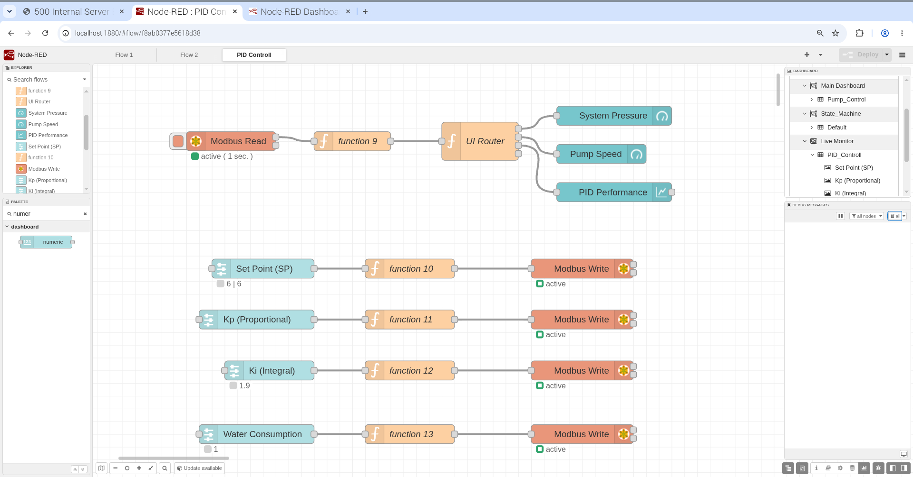
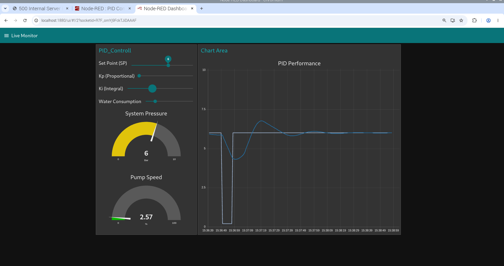

# 🚀 Phase 14: Closed-Loop PID Control, Live HMI Tuning & Disturbance Rejection

Transitioning from discrete logic to continuous analog control, Phase 14 transforms the system into a fully functional Closed-Loop PID controller. The Node-RED interface has been upgraded from a passive monitoring dashboard into a bidirectional SCADA control room, allowing operators to tune PID parameters live, simulate system disturbances, and monitor dynamic responses in real-time.

## 🏗️ Architectural Upgrades

### 1. Bidirectional SCADA Memory Mapping (`%MW`)
To allow the HMI to write data to the PLC without conflicting with the runtime engine's cycle lock, the control variables were migrated from Output Registers (`%QW`) to Internal Memory Words (`%MW`).
*   **Holding Registers (FC 3 & FC 6):** Set Point (SP), Kp, Ki, and Water Consumption are mapped to `%MW0` through `%MW6` (Modbus addresses 1024 to 1030). This allows Node-RED to both read the current state and preset new values dynamically.

### 2. Modbus Floating-Point Scaling Strategy
Modbus networks traditionally struggle with 32-bit floating-point (`REAL`) numbers. A robust industrial scaling technique was implemented:
*   **Network Layer:** All variables are transmitted as 16-bit Integers (`INT`).
*   **Node-RED Side:** JavaScript function nodes multiply inputs by 100 before writing (e.g., `4.5` becomes `450`). Upon reading, data is divided by 100 to restore two decimal places.
*   **PLC Side:** The PLC converts the incoming Modbus `INT` back to `REAL` and divides by 100.0 for precise PID mathematical execution.

### 3. Disturbance Rejection & System Dynamics
To validate the PID controller's performance, a "Water Consumption" variable was introduced to act as a system load/disturbance.
*   By increasing the consumption via the HMI, the operator simulates a physical valve opening. The PV (Pressure) drops, forcing the PID loop to dynamically calculate a new MV (Pump Speed) to reject the disturbance and restore the Set Point (SP).

## 🌐 Node-RED & UI/UX Upgrades

The dashboard layout was redesigned to match professional SCADA HMI standards, utilizing separate operational groups.

*   **Synchronized Feedback Loop:** To prevent "Slider Fights" (where the network overwrites the operator's input), the `UI Router` node sends continuous Modbus feedback directly into the input nodes. This ensures the HMI always perfectly reflects the PLC's internal memory.
*   **Segmented Layout:**
    *   `Chart Area`: Features a large, real-time PID Performance chart tracking SP (Target) and PV (Actual Pressure).
    *   `PID_Controll`: Contains granular numeric inputs and sliders for SP, Kp, Ki, and Consumption, alongside live gauges for Pump Speed (%) and System Pressure (Bar).

## 💻 Structured Text (ST) Code Additions

Below is the scaled memory mapping and conversion logic added to `PROGRAM main` to support the bidirectional PID network:

```iecst
    // ==========================================
    // NEW VAR BLOCK: BIDIRECTIONAL HMI REGISTERS
    // ==========================================
    VAR
        // Mapped to Internal Memory (%MW) starting at Modbus Address 1024
        MB_SP AT %MW0 : INT;             
        MB_PV AT %MW1 : INT;             
        MB_Pump_Speed AT %MW2 : INT;     
        MB_Kp AT %MW3 : INT;             
        MB_Ki AT %MW4 : INT;             
        MB_Kd AT %MW5 : INT;             
        MB_Consumption AT %MW6 : INT;
        
        // Internal REAL variables for precise PID math
        rGlobal_SP : REAL;         
        rGlobal_PV : REAL;         
        rKp : REAL;                
        rKi : REAL;                
        rWater_Consumption : REAL; 
        Cmd_Pump_Speed : REAL := 0.0;
    END_VAR

    // ==========================================
    // INITIALIZATION & SAFE DEFAULTS
    // ==========================================
    IF MB_SP = 0 THEN
        MB_SP := 400;          // Default SP: 4.00 Bar
        MB_Kp := 200;          // Default Kp: 2.00
        MB_Ki := 50;           // Default Ki: 0.50
        MB_Consumption := 200; // Default Load: 2.00
    END_IF;

    // ==========================================
    // INPUT SCALING: MODBUS (INT) -> PID (REAL)
    // ==========================================
    rGlobal_SP := INT_TO_REAL(MB_SP) / 100.0;
    rKp := INT_TO_REAL(MB_Kp) / 100.0;
    rKi := INT_TO_REAL(MB_Ki) / 100.0;
    rWater_Consumption := INT_TO_REAL(MB_Consumption) / 100.0;

    // ... [PID Function Block executes here using REAL variables] ...

    // ==========================================
    // OUTPUT SCALING: PID (REAL) -> MODBUS (INT)
    // ==========================================
    MB_PV := REAL_TO_INT(rGlobal_PV * 100.0);
    MB_Pump_Speed := REAL_TO_INT(Cmd_Pump_Speed * 100.0);
```

## 📸 Snapshots

**1. Node-RED Flow (Bidirectional Data Routing & Modbus Scaling):**

**2. HMI Dashboard (Live PID Tuning & Disturbance Rejection Chart):**
