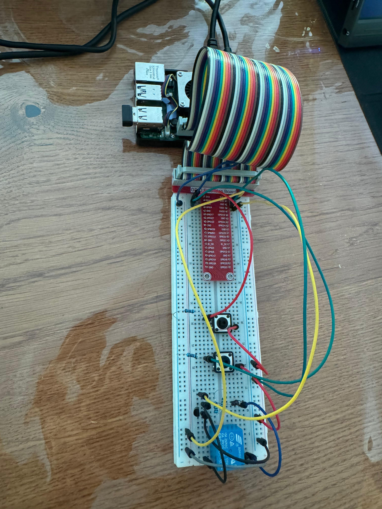
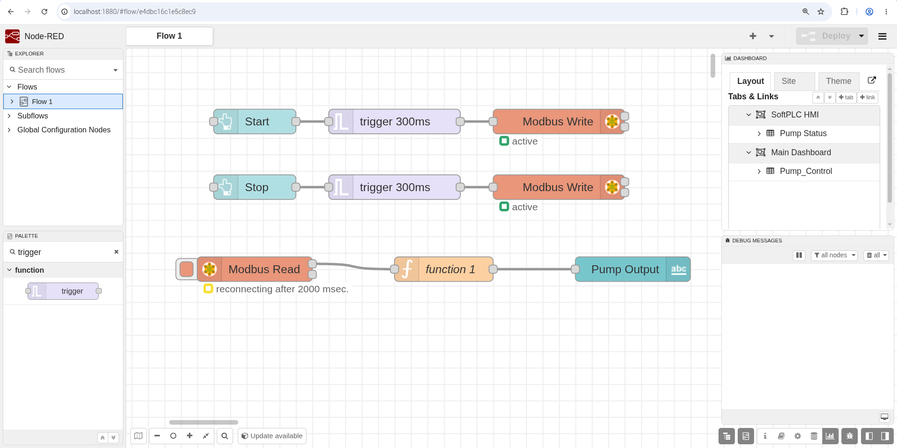
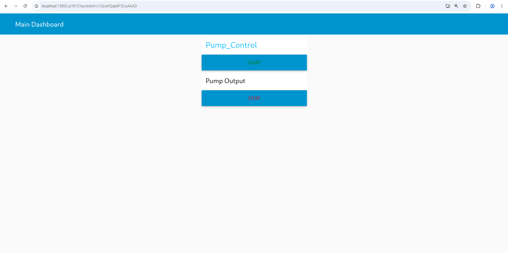
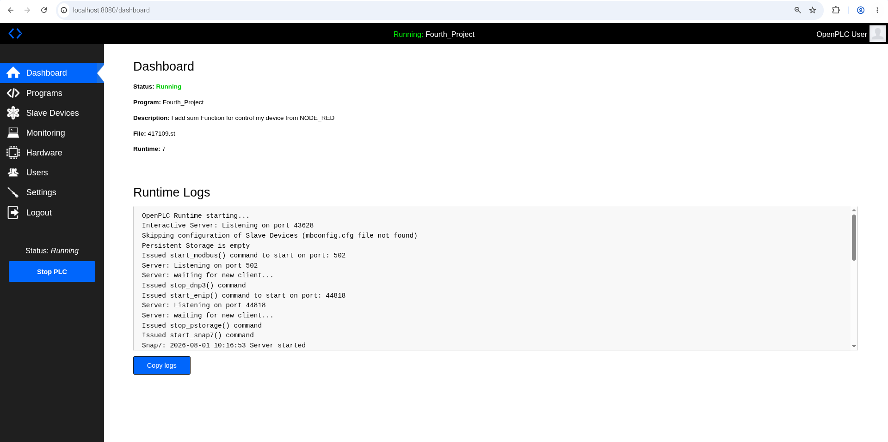
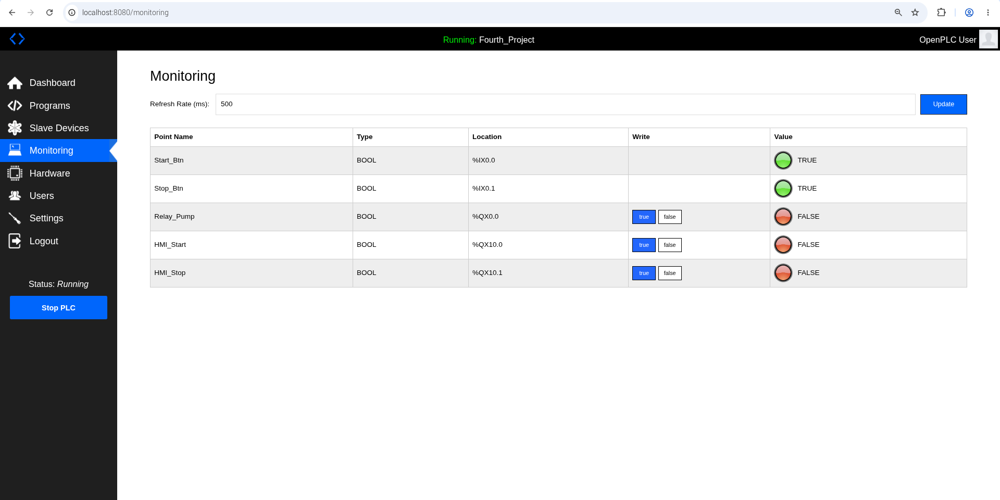

# 🏭 PLC Learning: Embedded SoftPLC on Raspberry Pi

Welcome to my **PLC Learning** repository! This project documents my journey in building an industrial-grade SoftPLC system using an Embedded Linux environment. The goal is to bridge the gap between embedded hardware (Raspberry Pi) and industrial automation standards (IEC 61131-3).

---

## 🛠️ System Architecture

### Hardware Stack
The physical layer is built to simulate a real industrial control panel, handling noise and inductive loads properly:
*   **Controller:** Raspberry Pi (acting as the SoftPLC brain)
*   **Inputs:** 2x Push Buttons (Start / Stop) 
    *   *Design:* **Active-Low** configuration with **10kΩ Hardware Pull-Up** resistors to eliminate floating pin noise.
*   **Output:** 5V Relay Module
    *   *Driver Circuit:* Custom-built on a breadboard using an **NPN Transistor (SS8050)**, base resistor, and a **Flyback Diode** to protect the Pi from inductive spikes.

### Software Stack
*   **Runtime:** OpenPLC v3 (Embedded Linux version)
*   **Language:** Structured Text (ST) conforming to IEC 61131-3 standards
*   **Task Configuration:** Running on a cyclic task with a `20ms` interval.

---

## 🚀 Development Phases

### Phase 1: Hardware Integration & Basic Latch Logic (Completed)
The primary goal of this phase was to establish a stable communication between the OpenPLC runtime and the GPIOs of the Raspberry Pi.
*   Successfully mapped I/O pins (`%IX0.0`, `%IX0.1`, `%QX0.0`).
*   Implemented a standard motor starter logic (Latch Circuit) using Structured Text.
*   Successfully tested hardware debounce and relay switching without Pi resets or crashes.

#### 📸 Hardware Setup


### Phase 2: Advanced Control Logic with Timers (Completed)
Building upon the stable hardware layer, the core logic was upgraded to simulate a real-world industrial fluid control system (e.g., pipe clearing or surge prevention).

#### Industrial Scenarios Implemented:
1.  **3-Second Start Delay (TON):** The Start button must be held continuously for 3 seconds to activate the pump. This filters out accidental touches and electrical noise.
2.  **5-Second Line Clearing / Stop Delay (TOF):** When the Stop command is issued, the pump continues to run for exactly 5 seconds before shutting down to clear remaining fluids from the pipeline.

#### I/O & Variables Mapping:
| Variable Name | Data Type | PLC Address | Description |
| :--- | :--- | :--- | :--- |
| `Start_Btn` | `BOOL` | `%IX0.0` | Active-Low input to start the sequence |
| `Stop_Btn` | `BOOL` | `%IX0.1` | Input to break the latch (Emergency/Stop) |
| `Relay_Pump` | `BOOL` | `%QX0.0` | Output signal to the NPN relay driver |
| `System_Run` | `BOOL` | Internal | Software latching state |
| `Delay_Timer` | `TON` | Internal | Timer On Delay (Start Delay) |
| `Delay_Timer_2` | `TOF` | Internal | Timer Off Delay (Stop Delay) |

#### Structured Text (ST) Code:
```st
Program main
    Var
        Start_Btn AT %IX0.0 : BOOL;
        Stop_Btn AT %IX0.1 : BOOL;
        Relay_Pump AT %QX0.0 : BOOL;
    End_Var
    
    Var
        System_Run : BOOL;
        Delay_Timer : TON;
        Delay_Timer_2 : TOF;
    End_Var

    // Latch logic for Active-Low Start Button
    System_Run := ((NOT Start_Btn) OR System_Run) AND Stop_Btn;
    
    // 3-Second Start Delay
    Delay_Timer(IN := System_Run, PT := T#3s);
    
    // 5-Second Stop Delay / Line Clearing
    Delay_Timer_2(IN := Delay_Timer.Q , PT := T#5s);
    
    // Output assignment
    Relay_Pump := Delay_Timer_2.Q;
End_Program

Configuration Config0
    Resource Res0 ON PLC
        Task Task0 (Interval := T#20ms, Priority := 0);
        Program Inst0 WITH Task0 : main;
    End_Resource
End_Configuration


### Phase 3: HMI Dashboard & Bidirectional Control (Modbus TCP)

In this phase, a graphical Human-Machine Interface (HMI) was developed using **Node-RED**. The system now supports bidirectional communication (Closed-Loop) via Modbus TCP, allowing real-time monitoring of the physical relay and providing software override controls from a web browser.

#### 🌐 Modbus Architecture & UI Integration
* **Monitoring (Read):** Reading the actual pump relay state (`%QX0.0` ➔ Modbus Coil `0`) using `FC 1: Read Coils`. The raw boolean data is parsed via a JavaScript function for dynamic UI display.
* **Control (Write):** Soft Start and Stop buttons on the Node-RED dashboard write directly to OpenPLC variables (`%QX10.0` ➔ Modbus Coil `80` and `%QX10.1` ➔ Modbus Coil `81`) using `FC 5: Force Single Coil`.
* **Push-Button Simulation:** A professional 300ms trigger pulse technique was implemented in Node-RED. This mimics a momentary physical push-button press, preventing the software coils from getting stuck in a `TRUE` state.

#### 📊 Updated I/O & Variables Mapping

| Variable Name | Data Type | PLC Address | Modbus Address | Description |
| :--- | :--- | :--- | :--- | :--- |
| Start_Btn | BOOL | `%IX0.0` | Discrete Input 0 | Hardware Active-Low Start |
| Stop_Btn | BOOL | `%IX0.1` | Discrete Input 1 | Hardware Emergency/Stop |
| Relay_Pump | BOOL | `%QX0.0` | Coil 0 | Physical Output & Read Monitor |
| HMI_Start | BOOL | `%QX10.0` | Coil 80 | Software Start (from Node-RED) |
| HMI_Stop | BOOL | `%QX10.1` | Coil 81 | Software Stop (from Node-RED) |

#### 💻 Updated Structured Text (ST) Code:

```pascal
Program main
    Var
        Start_Btn AT %IX0.0 : BOOL;
        Stop_Btn AT %IX0.1 : BOOL;
        Relay_Pump AT %QX0.0 : BOOL;
        HMI_Start AT %QX10.0 : BOOL;
        HMI_Stop AT %QX10.1 : BOOL;
    End_Var
    
    Var
        System_Run : BOOL;
        Delay_Timer : TON;
        Delay_Timer_2 : TOF;
        Stop_CMD : BOOL;
        Start_CMD : BOOL;
    End_Var

    // Combining Hardware (Active-Low) and Software (Active-High) Inputs
    Stop_CMD := Stop_Btn AND (NOT HMI_Stop);
    Start_CMD := (NOT Start_Btn) OR HMI_Start;
    
    // Core Latch Logic
    System_Run := (Start_CMD OR System_Run) AND Stop_CMD;
    
    // 3-Second Start Delay (Noise Filtration)
    Delay_Timer(IN := System_Run, PT := T#3s);
    
    // 5-Second Stop Delay (Pipe Clearing)
    Delay_Timer_2(IN := Delay_Timer.Q , PT := T#5s);
    
    // Output Assignment
    Relay_Pump := Delay_Timer_2.Q;
End_Program

Configuration Config0
    Resource Res0 ON PLC
        Task Task0 (Interval := T#20ms, Priority := 0);
        Program Inst0 WITH Task0 : main;
    End_Resource
End_Configuration

#### 📸 Phase 3 Snapshots

**1. Node-RED Logic Flow:**


**2. Web HMI Dashboard:**


**3. OpenPLC Runtime Dashboard:**


**4. OpenPLC Live Monitoring:**
